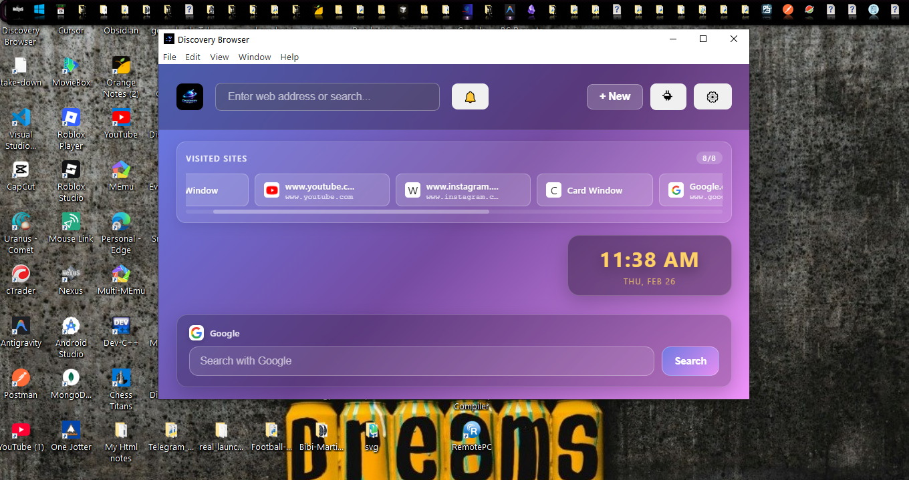
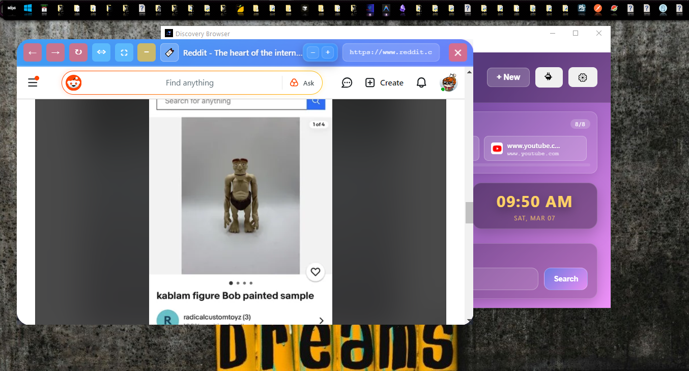
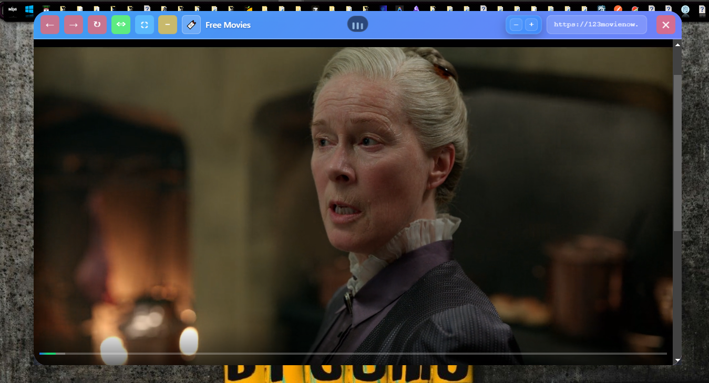
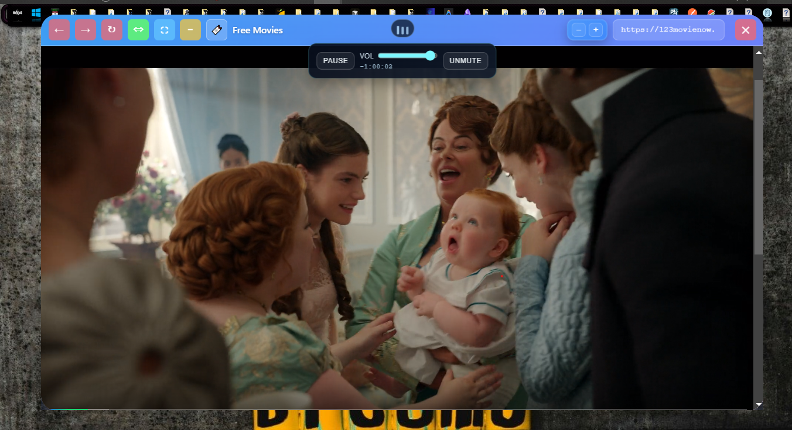
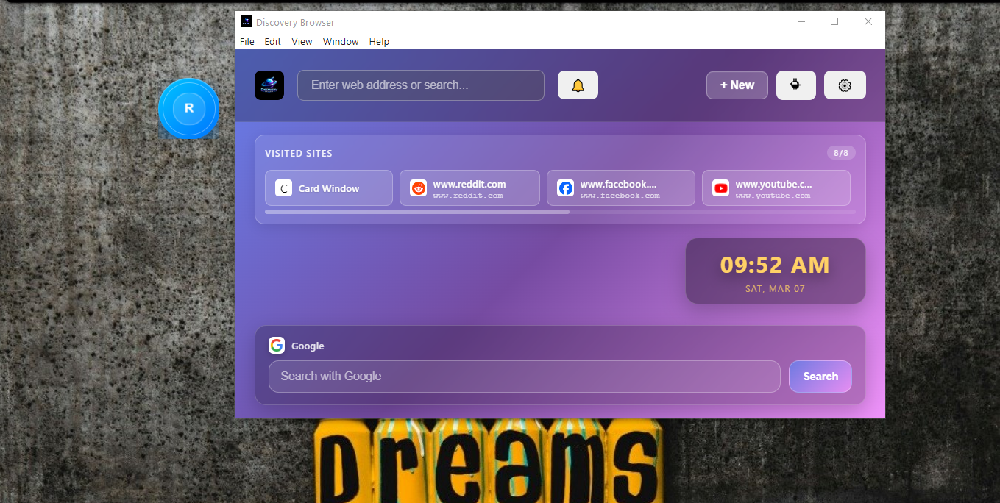
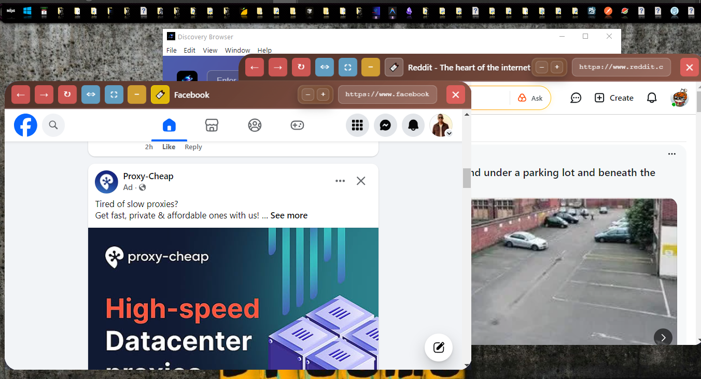
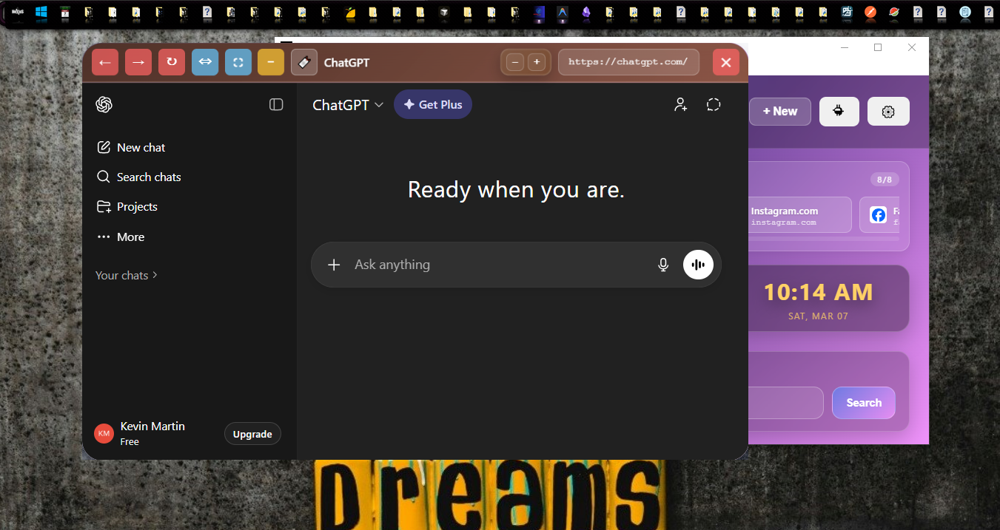

# Discovery Browser



**Discovery Browser** is a modern Electron-based web browser built around a **card-style browsing experience** instead of traditional tabs. Web pages open in **floating, movable cards**, allowing users to multitask visually and organize browsing sessions in a more flexible way.

---

## About

Discovery Browser is an **open-source project created and maintained by Modern Tech**.

The goal of the project is to explore a more visual and flexible browsing workflow where web pages behave like **independent cards** rather than static tabs.

---

## Key Features

### Card-Based Browsing

Unlike traditional browsers that rely on tabs, Discovery Browser opens each webpage inside a **floating card window**.

Cards can be:

* Moved freely around the workspace
* Organized visually
* Resized and layered
* Used simultaneously for multitasking

---

### Card View Modes

Cards can launch in different viewing modes depending on the browsing experience you want:

* **Normal View** – Standard floating card layout
* **Wide View** – Expanded card for improved visibility
* **Full Screen** – Immersive browsing for a single page

These modes allow users to easily switch between **focused browsing and multitasking**.

---

### Bubble Mode

Cards can be minimized into **bubble indicators**, allowing quick switching between browsing sessions while keeping the workspace uncluttered.

---

### Custom Header Themes

Discovery Browser includes several vibrant header themes that change the appearance of floating cards.

Available themes:

* **Nebula Blue**
* **Rose Ember**
* **Emerald Mint**
* **Golden Flame**
* **Midnight Still**
* **Cocoa Earth**

These themes allow users to personalize the browsing experience.

---

### Download Management

The browser includes built-in download handling with:

* Download progress tracking
* Download history
* Integrated download management

---

### External URL Handling

Discovery Browser can handle external links from other applications and automatically open them inside **new browsing cards**.

---

## Screenshots

### Discovery Browser Interface

|                                        |                                        |
| -------------------------------------- | -------------------------------------- |
|  |  |
|  |  |
|  |  |

### Additional View



---

## Tech Stack

Discovery Browser is built using modern web technologies:

* **Electron**
* **Node.js**
* **HTML**
* **CSS**
* **JavaScript**

---

## Project Structure

```text
.
├── assets/                     # App icons and visual assets
├── screenshots/                # UI screenshots used in documentation
│   ├── discoverybrowser1.png
│   ├── discoverybrowser2.png
│   ├── discoverybrowser3.png
│   ├── discoverybrowser4.png
│   ├── discoverybrowser5.png
│   ├── discoverybrowser6.png
│   └── discoverybrowser7.png
│
├── node_modules/               # Installed dependencies
│
├── src/                        # Frontend UI files
│   ├── addon-service.js
│   ├── card-bubble.html
│   ├── card.html
│   ├── index.html
│   ├── renderer-new.js
│   ├── renderer.js
│   └── styles.css
│
├── installer.nsh               # NSIS installer configuration
├── main.js                     # Main Electron process
├── preload.js                  # Base preload bridge
├── preload-card.js             # Card communication bridge
├── preload-card-overlay.js     # Overlay card bridge
├── preload-card-bubble.js      # Bubble card bridge
├── preload-webview.js          # Webview communication bridge
│
├── package.json
├── package-lock.json
├── .gitignore
├── LICENSE
└── README.md
```

---

## Development

### Requirements

Before running Discovery Browser locally, install:

* **Node.js v18 or higher**
* **npm**

---

### Installation

Clone the repository:

```bash
git clone https://github.com/yourusername/discovery-browser.git
cd discovery-browser
```

Install dependencies:

```bash
npm install
```

Run the browser in development mode:

```bash
npm start
```

or

```bash
npm run dev
```

---

## Building

Discovery Browser uses **electron-builder** for packaging.

### Windows

```bash
npm run build:win
```

This generates an **NSIS installer** in the `dist` folder.

### macOS

```bash
npm run build:mac
```

### Linux

```bash
npm run build:linux
```

---

## Contributing

Contributions are welcome.

If you'd like to contribute:

1. Fork the repository
2. Create a new feature branch
3. Make your changes
4. Submit a pull request

Bug reports and feature suggestions are also encouraged.

---

## License

This project is licensed under the **Apache License 2.0**.

See the **LICENSE** file for details.

---

## Trademark Notice

**Discovery Browser** and the Discovery Browser name are trademarks of **Modern Tech**.

While the source code is open and available under the Apache 2.0 License, the **Discovery Browser name and branding may not be used to distribute modified versions of this software without permission.**

---

## Author

Created and maintained by **Modern Tech**

---

**Discovery Browser**

A modern experiment in **visual card-based web browsing** built with Electron.
